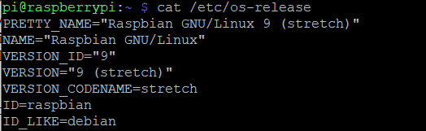

# OSC with RPi with Max
Un program ce permite controlul unor parametrii/sunete din Max, 
folosind OSC si un display cu touchscreen.

## (Instalare)
1. Am avut nevoie de un modul RPi, o tastatura, un mouse, un monitor, un display cu touchscreen.
(vezi linkuri) + un card SD pe care sa pun imaginea sistemului de operare pentru RPi

2. Am formatat cardul SD cu imaginea de OS. Versiunea de Raspbian folosita:

3. La prima pornire a RPi am conectat un display, tastatura si mouse pentru a face setarile necesare
pentru mai tarziu. L-am conectat la reteaua de internet iar din configuratii am activat SSH-ul.

4. Pe laptop mi-am instalat PuTTY pentru a controla in  reteta RPi-ul. 
[link aici] (https://www.raspberrypi.org/documentation/remote-access/ssh/windows.md)

5.Configurare display: [display folosit](http://www.lcdwiki.com/3.5inch_RPi_Display)
sudo rm -rf LCD-show
git clone https://github.com/goodtft/LCD-show.git
chmod -R 755 LCD-show
cd LCD-show/
sudo ./LCD35-show

Deoarece axele X si Y pe display-ul cu touch erau inversate, a trebuit sa modific o setare:
cd /etc/X1/xorg.conf.d
sudo nano 99-calibration.conf

am modificat swapaxes din 1 in 0

6. [Instalare Node.js](https://learn.adafruit.com/node-embedded-development/installing-node-dot-js)
+ instalare libcairo2-dev : sudo apt-get install libcairo2-dev

7. Descarcare repository OSC Examples:
+ git clone https://github.com/toddtreece/osc-examples.git

+ cd osc-examples

+ npm install

## (Utilizare)
tbd

## (Istoric)

(13.05) Voi atasa un display cu touchscreen la modulul Raspberry Pi 3, 
ca [aici](https://learn.adafruit.com/raspberry-pi-open-sound-control/overview) ,  
si voi modifica exemplul de cod oferit pentru Max de pe github. Ma voi folosi de 
touchscreen fie pentru a modifica valori ale unor parametrii in max, fie pentru a selecta
anumite sample-uri de sunete.

(3.06) Avand in vedere ca am avut probleme cu configurarea display-ului cu touchscreen,
pana astazi am reusit sa il fac sa functioneze.(axele x si y ale display-ului erau inversate)
Am atasat si modulul de camera la RPi, deoarece as vrea sa introduc si partea de interactiune 
prin camera la proiect, daca am suficient timp.

Problema majora cu display-ul a fost ca nu era compatibil cu sistemele de operare Raspbian cele mai recente.
Asa ca am instalat mai multe sisteme de operare pe rand pana am gasit unul compatibil din 2018...

(5.06) Voi crea in Max patch-ul care imi va permite sa folosesc display-ul cu touch pentru
a canta diferite sunete salvate in Max.

(7.06) Voi introduce modulul de camera in proiect si voi modifica/adauga anumiti parametri
pentru a avea partea de originalitate in proiect.

...

## (Link-uri)
[Proiectul de referinta](https://learn.adafruit.com/raspberry-pi-open-sound-control/overview)  
[Exemplu cod Max - Github](https://github.com/toddtreece/osc-examples/tree/master/max)  
[Display](https://cleste.ro/touchscreen-lcd-3-5-raspberry-pi.html?utm_medium=GoogleAds&utm_campaign=ShoppingAds&utm_source=&gclid=CjwKCAjwnPOEBhA0EiwA609Redt0FJatNi1cETA4rIvLW_SqGVTzwSwQtlyhd4GbRK3dNmiwhXP7jBoCPN4QAvD_BwE)  
[RPi](https://www.raspberrypi.org/products/raspberry-pi-3-model-b/)  

